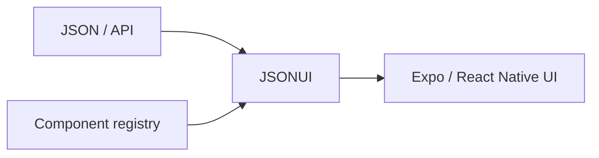

# medhira-rn-expo-json-ui-engine

<p align="center">
  
</p>

<p align="center">
  <strong>Engineering Intelligence Across Everything</strong>
</p>

<p align="center">
  <a href="https://www.npmjs.com/package/medhira-rn-expo-json-ui-engine"></a>
  <a href="https://github.com/HELLOMEDHIRA/medhira-rn-expo-json-ui-engine/blob/main/LICENSE"></a>
  <a href="https://expo.dev/changelog/sdk-56"></a>
</p>

A **JSON-driven UI engine** for **React Native + Expo** that renders screens at runtime from JSON — ideal for backend-driven apps, chatbot layouts, and low-code platforms.

> **Requires Expo SDK 56+** and the React Native New Architecture.

---

## Why MEDHIRA?

| Benefit | Description |
|--------|-------------|
| **Backend-driven UI** | Ship layouts from API/CMS without app store releases |
| **Runtime rendering** | Static JSON, sync/async functions, or observables |
| **Performance** | Style caching via [`medhira-rn-styles-cache`](https://www.npmjs.com/package/medhira-rn-styles-cache) |
| **Extensible** | Reusable registry with `defineUseComponent` |
| **Type-safe** | Full TypeScript definitions |



---

## Compatibility

| Requirement | Version |
|-------------|---------|
| Expo SDK | **56+** |
| React Native | **0.85+** |
| React | **19+** |
| Node.js | **20+** |

---

## Installation

```bash
npm install medhira-rn-expo-json-ui-engine
# or
yarn add medhira-rn-expo-json-ui-engine
```

### Peer dependencies

```bash
npx expo install expo react react-native react-native-gesture-handler react-native-reanimated react-native-worklets react-native-pager-view
```

### Expo modules (install what you use)

```bash
npx expo install expo-image expo-camera expo-video expo-blur expo-linear-gradient \
  expo-checkbox expo-status-bar expo-gl expo-live-photo
```

---

## Quick start

```tsx
import { JSONUI } from 'medhira-rn-expo-json-ui-engine';

const ui = {
  type: 'Text',
  value: 'Hello JSON UI',
  props: { style: { fontSize: 24 } },
};

export default function App() {
  return <JSONUI json={ui} />;
}
```

### Dynamic source (including async)

```tsx
<JSONUI jsonSource={async () => fetchUiFromApi()} />
```

### Context + conditional UI

```tsx
<JSONUI
  json={menu}
  context={{ user: { role: 'admin' } }}
/>
```

```tsx
// TypeScript / TSX JSON objects:
showIf: (ctx) => ctx.user?.role === 'admin',
```

### Reusable components

```tsx
import { defineUseComponent, JSONUI } from 'medhira-rn-expo-json-ui-engine';

const Card = defineUseComponent('Card', { title: 'Title' }, {
  type: 'ViewContainer',
  wrapperComponent: 'View',
  properties: [{ type: 'Text', value: '{{title}}' }],
});

<JSONUI json={{ type: 'useComponent', ref: 'Card', props: { title: 'Hi' } }} />;
```

---

## Features

- Render UI from JSON, arrays, functions, Promises, or observables
- `defineUseComponent` registry with `{{placeholder}}` strings
- `showIf` boolean or context-aware functions
- Built-in Expo / RN components (Text, Image, FlashList, Camera, Lottie, Carousel, **PagerView**, …)
- `JSONUIErrorBoundary` for production safety
- Apache-2.0 licensed

---

## Documentation

- [Full docs](https://medhira-rn-expo-json-ui-engine.readthedocs.io) (MkDocs)
- [Contributing](./CONTRIBUTING.md)
- [Changelog](./CHANGELOG.md)
- [Security](./SECURITY.md)

---

## Example app

```bash
yarn install
yarn example
```

---

## License

Apache-2.0 © MEDHIRA — see [LICENSE](./LICENSE) and [NOTICE](./NOTICE).
