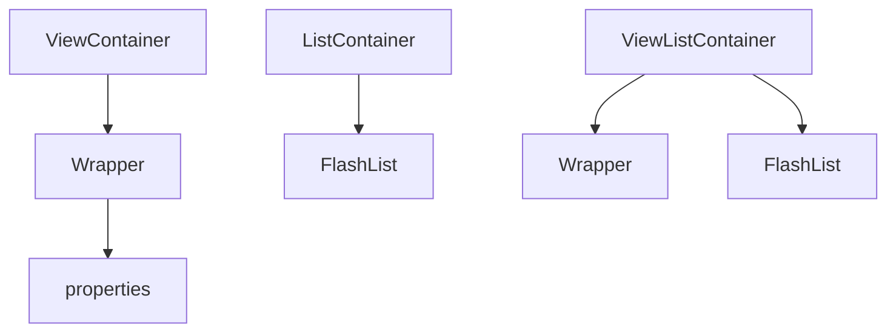

# Container Components



## ViewContainer

```tsx
{
  type: 'ViewContainer',
  wrapperComponent: 'SafeAreaView',
  props: { style: { flex: 1 } },
  properties: [{ type: 'Text', value: 'Child' }]
}
```

## ListContainer

```tsx
{
  type: 'ListContainer',
  props: {
    data: [
      { type: 'Text', value: 'Item A' },
      'Item B'
    ],
    estimatedItemSize: 48
  }
}
```

Primitives in `data` are auto-wrapped as `Text` nodes.

## ViewListContainer

```tsx
{
  type: 'ViewListContainer',
  wrapperComponent: 'View',
  listProps: { data: items, estimatedItemSize: 60 }
}
```

## Next

- [Basic Components](./basic-components.md)
