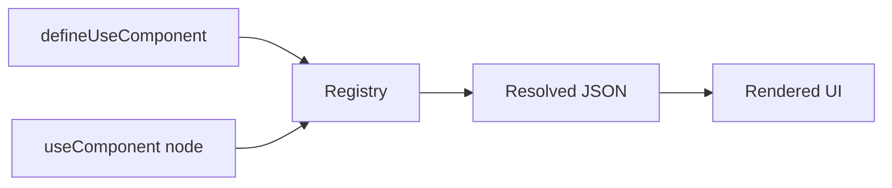

# Component Registry

Register reusable JSON templates with `defineUseComponent`.



## Define a component

```tsx
import { defineUseComponent } from 'medhira-rn-expo-json-ui-engine';

const UserCard = defineUseComponent(
  'UserCard',
  { name: 'Guest', email: '' },
  {
    type: 'ViewContainer',
    wrapperComponent: 'View',
    properties: [
      { type: 'Text', value: '{{name}}' },
      { type: 'Text', value: '{{email}}' },
    ],
  }
);
```

## Use in JSON

```tsx
{
  type: 'useComponent',
  ref: 'UserCard',
  props: { name: 'Jane', email: 'jane@example.com' }
}
```

## Placeholders

- `{{name}}` — replaced from merged props
- Functions (e.g. `onPress`) should be passed via `props` on the `useComponent` node, not as placeholders

## Next

- [Dynamic Sources](./dynamic-sources.md)
