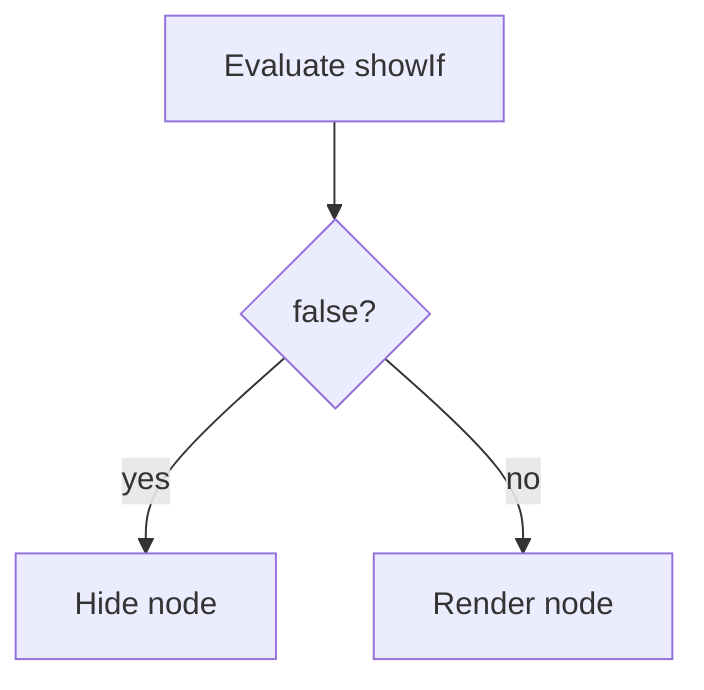

# Conditional Rendering

Use `showIf` on any node. Pass app state via the `context` prop on `JSONUI`.

## Boolean

```tsx
{ type: 'Text', value: 'Hidden', showIf: false }
```

## Context function

```tsx
<JSONUI
  context={{ user: { role: 'admin' } }}
  json={{
    type: 'Text',
    value: 'Admin only',
    showIf: (ctx) => ctx.user?.role === 'admin',
  }}
/>
```



!!! tip
    `showIf` functions receive `(context, component)`. For single-argument handlers, the engine merges `context` with `{ component }`.

## Role-based menu

```tsx
const menu = {
  type: 'ViewContainer',
  properties: [
    { type: 'Text', value: 'Home', showIf: true },
    {
      type: 'Text',
      value: 'Admin',
      showIf: (ctx) => ctx.user?.role === 'admin',
    },
  ],
};
```

## Next

- [Containers](../components/containers.md)
