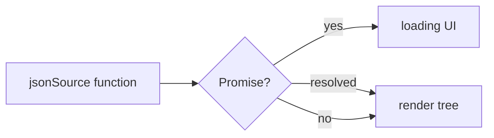

# Dynamic Sources

## Static JSON

```tsx
<JSONUI json={myJson} />
```

## Function sources

Sync:

```tsx
<JSONUI jsonSource={() => buildUiFromState()} />
```

Async (returns a `Promise`):

```tsx
<JSONUI
  jsonSource={async () => {
    const res = await fetch('https://api.example.com/ui');
    return res.json();
  }}
  loadingComponent={<ActivityIndicator />}
/>
```



## Observable sources

Any object with `subscribe` / `unsubscribe`:

```tsx
<JSONUI jsonSource={behaviorSubject$} />
```

## Comparison

| Source | Best for |
|--------|----------|
| `json` | Static screens |
| Sync function | Derived local state |
| Async function | API / CMS payloads |
| Observable | Live updates |

## Next

- [Conditional Rendering](./conditional-rendering.md)
