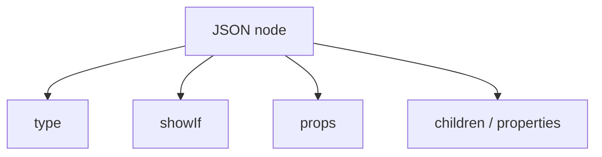

# JSON UI Basics

## Structure

Every node includes a `type` and optional modifiers:

```json
{
  "type": "Text",
  "key": "welcome",
  "showIf": true,
  "props": {},
  "value": "Hello"
}
```



| Field | Purpose |
|-------|---------|
| `type` | Component identifier (`Text`, `ViewContainer`, …) |
| `showIf` | `true`, `false`, or a function (see Conditional Rendering) |
| `props` | Passed to the underlying native component |
| `properties` | Child nodes for containers |
| `children` | Child nodes for gradients, masks, carousels, pager |

## Leaf vs container

**Leaf** — `Text`, `Button`, `Image`, …

**Container** — `ViewContainer`, `ListContainer`, `ViewListContainer`

## Example

```tsx
const dashboard = {
  type: 'ViewContainer',
  wrapperComponent: 'View',
  props: { style: { flex: 1, padding: 16 } },
  properties: [
    {
      type: 'Text',
      value: 'Dashboard',
      props: { style: { fontSize: 32, fontWeight: 'bold' } },
    },
  ],
};
```

## Next

- [Component Registry](./component-registry.md)
