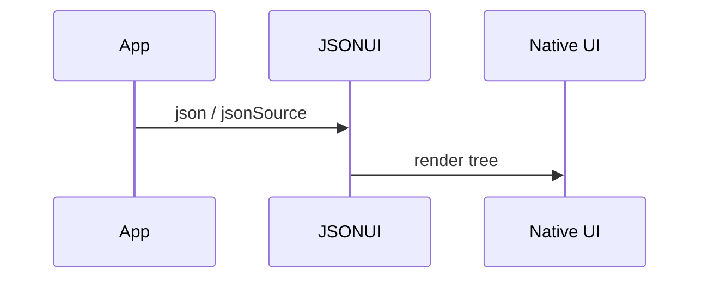

# Quick Start

## First screen

```tsx
import { JSONUI } from 'medhira-rn-expo-json-ui-engine';

const ui = {
  type: 'ViewContainer',
  wrapperComponent: 'View',
  props: { style: { padding: 20 } },
  properties: [
    {
      type: 'Text',
      value: 'Hello, MEDHIRA!',
      props: { style: { fontSize: 24, fontWeight: 'bold' } },
    },
  ],
};

export default function App() {
  return <JSONUI json={ui} />;
}
```

## Flow



## Dynamic sources

```tsx
// Sync
<JSONUI jsonSource={() => loadConfig()} />

// Async (Promise)
<JSONUI jsonSource={async () => fetch('/api/ui').then((r) => r.json())} />

// Observable (RxJS-like)
<JSONUI jsonSource={myObservable$} />
```

## Next steps

- [JSON UI Basics](../core-concepts/json-ui-basics.md)
- [Component Registry](../core-concepts/component-registry.md)
