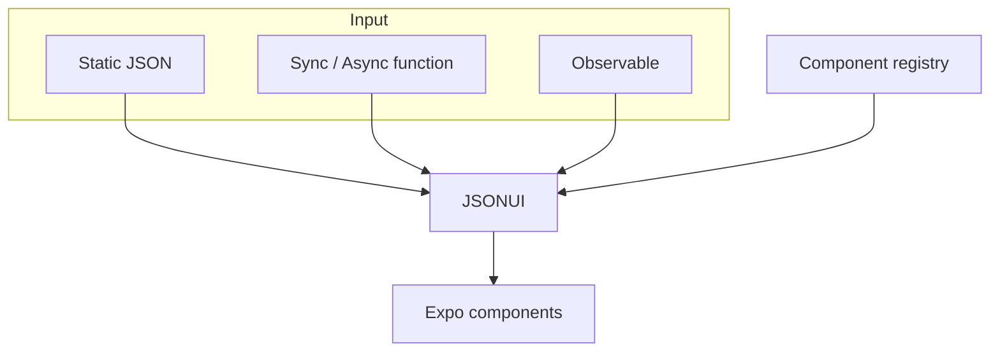

# medhira-rn-expo-json-ui-engine

<p align="center">
  
</p>

A JSON-driven UI engine for **Expo SDK 56+** that renders native interfaces at runtime.

!!! note
    Requires **Expo SDK 56 or higher** and the React Native **New Architecture**.

## Architecture



## Key features

- :material-render: Render UI from JSON
- :material-puzzle: Reusable components via `defineUseComponent`
- :material-update: Static, function, Promise, and observable sources
- :material-eye: Conditional visibility with `showIf` and `context`
- :material-cog: Style caching integration
- :material-language-typescript: TypeScript support

## Quick example

```tsx
import { JSONUI } from 'medhira-rn-expo-json-ui-engine';

const json = {
  type: 'Text',
  value: 'Hello MEDHIRA!',
  props: { style: { fontSize: 24 } },
};

export default function App() {
  return <JSONUI json={json} />;
}
```

## Support

- Email: **hello.medhira@gmail.com**
- GitHub Issues: [medhira-rn-expo-json-ui-engine](https://github.com/HELLOMEDHIRA/medhira-rn-expo-json-ui-engine/issues)

**MEDHIRA** — Engineering Intelligence Across Everything
